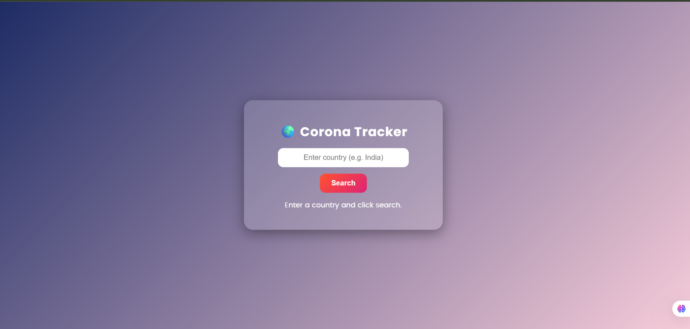
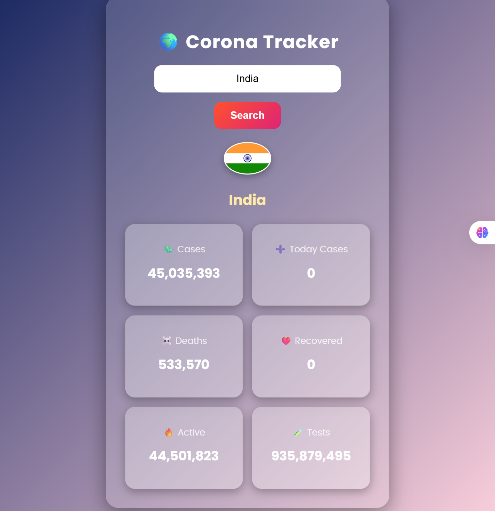
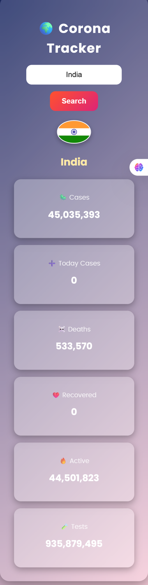

# 🌍 Corona Tracker

A simple and stylish **COVID-19 Tracker Web App** built with **HTML, CSS, and JavaScript**.  
This app allows users to search for any country and view **live COVID-19 statistics** including cases, deaths, recovered, active, and tests.  

---

## 🚀 Features
- 🔎 **Country-specific search** for COVID-19 stats  
- 📊 **Live data** via [disease.sh API](https://disease.sh/)  
- 🎨 **Glassmorphism design** with smooth animations  
- 📱 **Responsive design** (desktop & mobile friendly)  
- ⚡ **Real-time data fetching** with async JavaScript  

---

## 🖼️ Screenshot
  
  
  

---

## 🛠️ Technologies Used
- **HTML5** – Structure  
- **CSS3** – Styling (gradients, animations, responsive design)  
- **JavaScript (ES6)** – API fetching & DOM updates  
- **[disease.sh API](https://disease.sh/)** – COVID-19 live data  

---

## 📂 Project Structure

corona-tracker/
│── index.html # UI Layout
│── style.css # Glassmorphism styles + animations
│── script.js # Fetching data + DOM rendering
│── README.md # Documentation
│── screenshot.png # Demo preview image

📱 Responsive Design

✔ Desktop supported

✔ Tablet supported

✔ Mobile supported

📌 Future Improvements

🌍 Add global stats dashboard

📈 Integrate charts/graphs with Chart.js

🌑 Add Dark/Light mode toggle

🌐 Multi-language support
